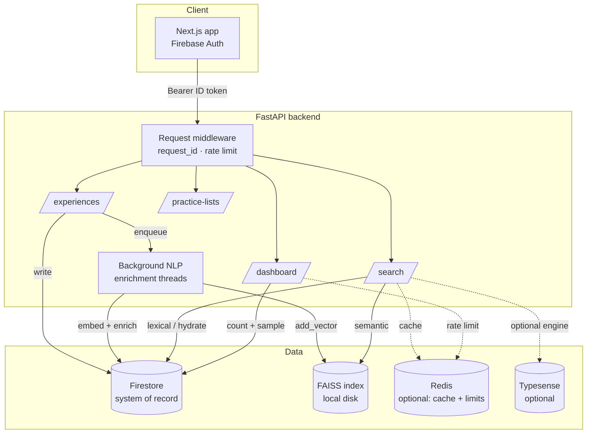

# HireLog Architecture

HireLog is an interview-experience archive with hybrid semantic + lexical search,
background AI enrichment, and role-gated analytics. Next.js frontend, FastAPI
backend, Firebase (Auth + Firestore) as the system of record, FAISS for vectors,
optional Redis + Typesense.

## System diagram

## Request flow — a search

1. Frontend sends `GET /api/search` with a Firebase ID token.
2. Middleware assigns a `request_id` (logged on every line) and applies the
   `search`-namespaced rate limit.
3. Cache check (Redis → memory). On hit, return.
4. On miss, the hybrid retriever runs the **semantic** (FAISS, semaphore- and
   circuit-breaker-guarded) and **lexical** (BM25) branches, fuses with RRF, and
   optionally cross-encoder re-ranks the top-K. Documents are hydrated from
   Firestore, filtered, serialized (respecting the anonymity invariant), cached,
   and returned. See [adr/0001-hybrid-search.md](adr/0001-hybrid-search.md).

## Startup reconciliation (lifespan, background threads)

- **Seed** baseline data, then **rebuild FAISS from Firestore** if the index is
  empty/lost ([adr/0004](adr/0004-faiss-flatip-choice.md)).
- **Dashboard stats** warm; **practice-list stats** repaired incrementally.
- **NLP watchdog** resets documents stuck in `pending` past a grace window.
- **Search index** backfill / warmup.

## Key subsystems

| Concern | Where | ADR |
|---|---|---|
| Hybrid search | `api/routes/search.py`, `services/search_core.py` | 0001 |
| Anonymity guarantee | `api/routes/experiences.py` | 0002 |
| Caching | `api/routes/dashboard.py`, `services/search_cache.py` | 0003 |
| Vector index & recovery | `services/faiss_store.py`, `services/faiss_reconcile.py` | 0004 |
| Rate limiting | `core/rate_limit.py` | 0005 |
| Search evaluation | `eval/` | 0006 |
| Operations / recovery | — | [runbooks/backup-dr.md](runbooks/backup-dr.md) |
